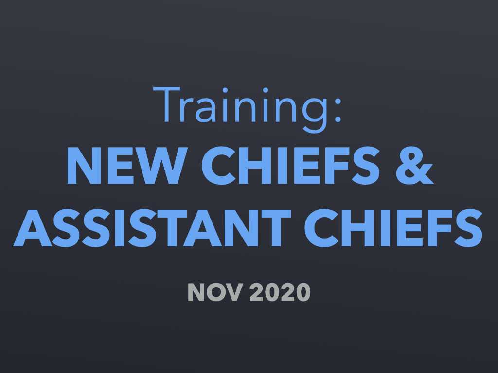

<!--  -->

# Welcome to the **New Chief and Assistant Chief** online training class!

It will take approximately **1 hour** to view this training class. You can pause anytime.

Audio narration plays automatically for each slide. At the end of each narration, you will advance to the next slide automatically.

<a class="homepage-button" href="./slides/001">Start training</a>

---

Helpful links:

* [Table of Contents](./toc) - all slide titles on one page
* [Slides Thumbnails](./thumbnails) - all slide images on one screen
* [Slides Summary](./summary) - all slide images and text side-by-side on one page

**Questions?** Call 703-324-4735 or email ElectionOfficerTraining@fairfaxcounty.gov. We are here to help!