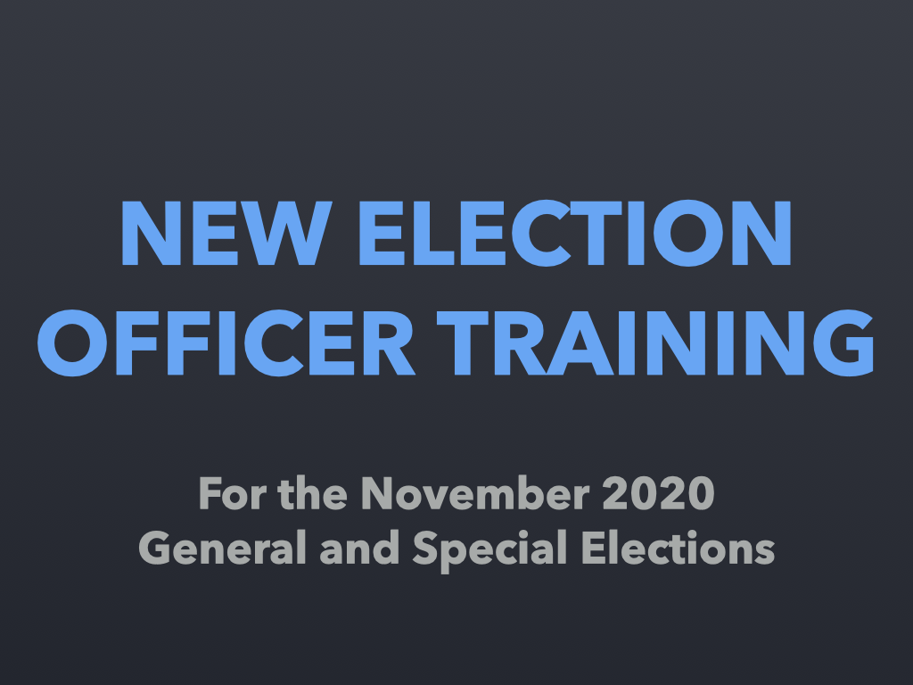

<!--  -->

# Welcome to the **New and Experienced Election Officer** online training class!

It will take approximately **2 hours** to view this training class. You can pause anytime.

Audio narration plays automatically for each slide. At the end of each narration, you will advance to the next slide automatically.

After reviewing the slides, you must take a quiz in the Election Officer Portal to receive credit and be eligible to serve as an election officer.

<a class="homepage-button" href="./slides/001">Start training</a>

---

Helpful links:

* <a href="./toc"><strong>Table of Contents</strong></a> (view all slide titles and jump to a slide quickly)
* <a href="./thumbnails"><strong>Slides Thumbnails</strong></a> (view all slide images and jump to a slide quickly)
* <a href="./summary"><strong>Slides Summary</strong></a> (view all slide images and text side-by-side on one page)

**Questions?** Call 703-324-4735 or email ElectionOfficerTraining@fairfaxcounty.gov. We are here to help!